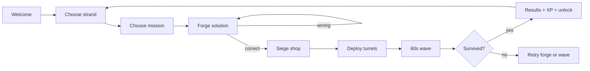

# Granny Boom — Siege Tactics
## One-Page Game Design Document (v1)

**Product:** Granny Boom — Siege Tactics  
**Platform:** Static browser (HTML/CSS/JS, GitHub Pages)  
**Audience:** Ages 9–12 · Australian Years 5–6  
**Session target:** 8–12 minutes per mission  

---

## Fantasy & hook

Kids already forged words in Granny Boom. Now aliens land in the backyard and march toward Granny's house (exit on the right). Players spend XP on turrets, maze the field, and survive a **60-second wave**. Maths happens *before* the fight — the forge is the gate, not a worksheet.

**Taglines:** *You forged the words. Now forge the fence.* / *They've landed. Hold the line.*

---

## Session loop



**Micro-win cadence:** forge success (~2 min) → shop/placement (~3 min) → wave payoff (~1 min) → results (~30 s) = ~6–7 min core; padding from strand/mission pick and Granny lines → 8–12 min.

---

## Strands & missions (v1 — 12 total)

### Number (6 missions)

| # | ID | Title | Level | AC v9 | Forge focus |
|---|-----|-------|-------|-------|-------------|
| 1 | `number-place-value-patrol` | **Place Value Patrol** | 1 | AC9M5N01 | Read multi-digit numbers; combine place values |
| 2 | `number-fraction-fence` | **Fraction Fence** | 1 | AC9M5N03 | Compare/order fractions with common denominators |
| 3 | `number-decimal-defence` | **Decimal Defence** | 2 | AC9M5N04 | Add/subtract decimals to hundredths |
| 4 | `number-ops-outpost` | **Order of Ops Outpost** | 2 | AC9M6N04 | Evaluate expressions with brackets |
| 5 | `number-ratio-rampart` | **Ratio Rampart** | 3 | AC9M6N05 | Solve simple ratio problems |
| 6 | `number-percent-perimeter` | **Percentage Perimeter** | 3 | AC9M6N06 | Find 10%/25%/50% of quantities |

### Measurement (6 missions)

| # | ID | Title | Level | AC v9 | Forge focus |
|---|-----|-------|-------|-------|-------------|
| 1 | `measure-length-lookout` | **Length Lookout** | 1 | AC9M5M01 | Convert cm ↔ m |
| 2 | `measure-area-array` | **Area Array** | 1 | AC9M5M02 | Area of rectangles (counting squares) |
| 3 | `measure-time-tower` | **Time Tower** | 2 | AC9M5M04 | Elapsed time (hours/minutes) |
| 4 | `measure-volume-vault` | **Volume Vault** | 2 | AC9M6M01 | Volume of rectangular prisms (unit cubes) |
| 5 | `measure-converting-castle` | **Converting Castle** | 3 | AC9M6M01 | Convert between common metric units |
| 6 | `measure-scale-siege` | **Scale Siege** | 3 | AC9M6M02 | Interpret simple scale on maps/plans |

**Level 1** = intro forge (clear labels), **2** = two-step reasoning, **3** = multi-step / less scaffolding.

---

## Forge UI (reuse Granny Boom container pattern)

```
┌─────────────────────────────────────────┐
│  Opener (Granny voice, 1–2 sentences)   │
├─────────────────────────────────────────┤
│  Slot 1 [role label]  ○ ○ ○ ○          │
│  Slot 2 [role label]  ○ ○ ○ ○          │
│  Slot 3 [role label]  ○ ○ ○ ○          │
├─────────────────────────────────────────┤
│  Lock-in: [ numeric / text input ]      │
│              [ CHECK ]                  │
└─────────────────────────────────────────┘
```

- Wrong slot picks → gentle retry toast; lock-in wrong → hint from Granny.
- Correct path → **Mission XP** (persistent) + **wave budget** (mission-only).

---

## Turret roster (v1 — 4 types, 2 upgrades each)

| Turret | Cost | Role | Upgrade 1 | Upgrade 2 |
|--------|------|------|-----------|-----------|
| **Pea Shooter** | 15 XP | Fast single-target, short range | +25% fire rate | +1 pierce |
| **Splatter Cannon** | 25 XP | Slow AoE splash | +20% splash radius | +15% damage |
| **Sniper Nest** | 35 XP | Long range, high damage, slow | +1 range tier | −20% reload time |
| **Glue Trap** | 20 XP | No damage; slows pathing | +10% slow | +2 s duration |

**Economy (Option A):** Forge grants persistent XP *and* a separate wave-only turret budget. Typical budget after forge: 60–90 XP (enough for 3–4 turrets + one upgrade if frugal).

---

## Tower defense (v1 simplified)

| Element | v1 | v2 (north star) |
|---------|----|-----------------|
| Field | 3 lanes + fixed placement pads | Full grass grid |
| Pathing | Lane-based (towers block *their* lane segment) | A* around towers |
| Wave | 60 s fixed; trickle → clump → mini-boss | Same + modifiers |
| Lives | 8 leaks max | Configurable per mission |
| Controls | Pause, 1× / 2× speed | + sell tower (v1.1) |

**Wave escalation (all missions):**

| Phase | Time | Behaviour |
|-------|------|-----------|
| Trickle | 0–15 s | 1 enemy every 3 s, low HP |
| Clump | 15–45 s | Groups of 3–5, medium HP |
| Mini-boss | 45–60 s | 1 heavy + escorts |

Mission `waveConfig` scales counts and HP; level 3 missions add a second mini-boss telegraph at 55 s.

---

## UI chrome

- **Topbar:** progress, XP, How to Play, link to grannyboom.com
- **How to Play:** 3-slide carousel + full guide page
- **Results:** score, XP earned, unlock banner, optional defence-bot collectible (1 per strand in v1)

---

## Engagement goals (match main Granny Boom)

| Goal | Implementation |
|------|----------------|
| Micro-wins every 60–90 s | Forge CHECK, first kill, wave phase change, survive |
| Clear choice | Strand tabs → mission grid |
| Visible progression | XP bar, mission unlocks, collectibles |
| 60 s reward burst | Defence wave (not shooter) |
| Low reading load | Short Granny lines, role labels on slots |
| "I built something" | Maze + solution path visible on field |

**Not v1:** 50 question types, worksheet feel, endless mode.

---

## AC v9 mapping summary

| Strand | Codes covered (v1) |
|--------|-------------------|
| Number | AC9M5N01, AC9M5N03, AC9M5N04, AC9M6N04, AC9M6N05, AC9M6N06 |
| Measurement | AC9M5M01, AC9M5M02, AC9M5M04, AC9M6M01, AC9M6M02 |

Proficiency emphasis rotates: **problem-solving** (pick the right container step), **fluency** (lock-in speed), **reasoning** (which step first — slot order matters narratively).

---

## Success criteria

1. A Year 5 class completes one mission in **under 12 minutes** without teacher help.
2. Kids describe it as *"Granny Boom but we defend the house"* — not *"maths app."*
3. Same engagement as main game: *"one more wave."*

---

## Out of scope (v1)

- Full Fieldrunners free-placement pathfinding
- Statistics / Probability strand
- Multiplayer, accounts, payments
- Endless / round-156 progression
